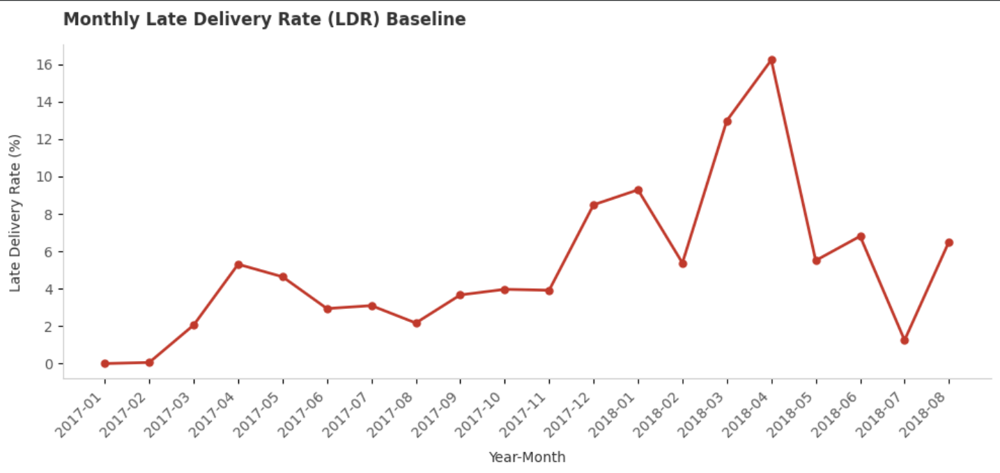
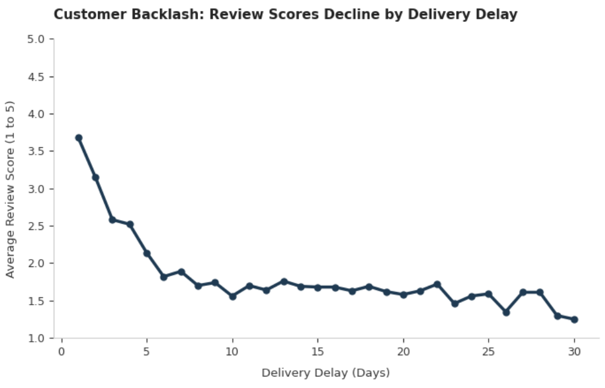
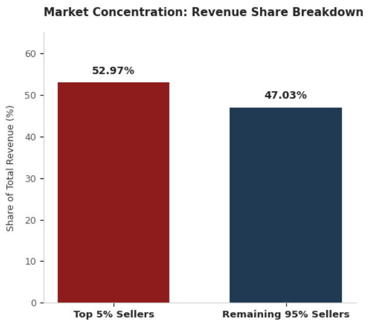
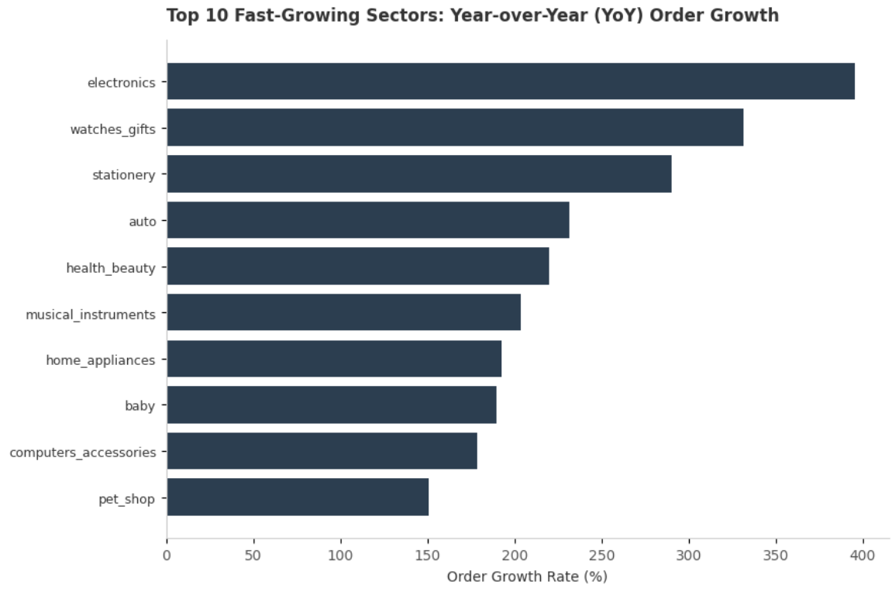

# E-Commerce Operational Analytics
**Dataset:** Olist Public E-Commerce Marketplace Data (100k+ Orders) · **Tools:** DuckDB SQL + Python · **Focus:** Delivery Performance, Marketplace Vendor Risk & Service Quality Metrics

---

## Overview

Most e-commerce data projects focus on consumer behavior — cohorts, CLV, conversion. This project focuses entirely on the supply side: delivery performance, vendor risk, and how internal operational failures translate into lost customer satisfaction. The central question is *how severely do delivery delays degrade review scores, and can we tie platform-wide satisfaction drops to specific monthly logistics bottlenecks?* Python handles cleaning and formatting, DuckDB drives the SQL aggregations, and Matplotlib produces the visualizations.

---

## Key Findings

- **LDR spiked from ~3% in mid-2017 to 16.23% by April 2018**, with the climb beginning in December 2017 (8.49%) — confirmed as a platform-wide logistics failure, not a category-specific supplier issue
- **Late orders generate bad reviews at 5.5× the rate of on-time orders**, with average review scores dropping from 4.21 → 2.26
- **Median review score hits 2.0 by day 3 of delay** — the intervention window is 48 hours
- **Top 5% of sellers drive 53% of platform revenue** — half the business depends on just 148 merchants, creating significant market concentration risk
- **State MA relies on a single seller** who handles all 398 orders but runs a 19.6% LDR — 3× the platform baseline
- **Electronics carries the highest freight burden at 29.5%** of item price, heavily penalizing a category with an average item price of just $56.78
- **Electronics and Watches/Gifts grew 395% and 331% YoY**, intensifying fulfillment pressure on already-strained supply chains

---

## Dataset

**Source:** [Olist E-Commerce Public Dataset](https://www.kaggle.com/datasets/olistbr/brazilian-ecommerce) (Kaggle)

| Table | Key Columns Used |
|---|---|
| `olist_orders.csv` | order status, purchase timestamp, delivery dates |
| `olist_order_items.csv` | product/seller linkage, price, freight |
| `olist_order_reviews.csv` | review score per order |
| `olist_products.csv` | product category (Portuguese) |
| `olist_sellers.csv` | seller state |
| `product_category_name_translation.csv` | Portuguese → English category mapping |

---

## Tech Stack

| Tool | Purpose |
|---|---|
| Python / Pandas | Data ingestion, type casting, null handling |
| DuckDB | In-process SQL analytics on DataFrames |
| Matplotlib | Line charts, bar charts, horizontal bar charts |
| Google Colab | Notebook environment |

---

## Project Structure

```
├── E-Commerce Operational Analytics.ipynb    # Main analysis notebook
├── screenshots/
│   ├── ldr_monthly_trend.png
│   ├── delay_vs_review_score.png
│   ├── market_concentration.png
│   └── category_yoy_growth.png
└── README.md
```

---

## Notebook Walkthrough

### 1. Data Loading & Subsetting
Six CSVs loaded from Google Drive. Only the relevant columns are kept per table to reduce memory overhead from the start.

### 2. Cleaning
- Parsed all date columns to `datetime`
- Filled missing product categories with `"unknown"`
- **Removed 189 "time-traveler" orders** — records where delivery timestamps precede purchase timestamps, which would produce negative delay values and skew every downstream metric
- Verified referential integrity across all joins (orphan orders, unlinked reviews, missing categories)
- Deduplicated reviews by averaging scores per `order_id`

### 3. SQL Layer (DuckDB)
Built a unified `sales` view joining all six tables, then a `sales_delivered` view scoped to confirmed deliveries with computed fields:
- `purchase_to_carrier_days` — warehouse processing time
- `delivery_delay_days` — actual vs. estimated delivery delta
- `transit_time_days` — carrier leg duration

### 4. Delivery Analysis
- Overall LDR: **6.6%** across 109,953 delivered orders; carrier-caused delays (6,726) dwarfed warehouse-caused ones (536)
- Bucketed delays: 29% Minor (1–3 days), 28% Moderate (4–7), 22% Serious (8–14), 21% Critical (15+)
- Monthly LDR trend showed a steady climb from Dec 2017 (8.49%) → Jan 2018 (9.29%) → Apr 2018 peak (16.23%), recovering to ~5–7% by May 2018
- Confirmed the spike was **platform-wide** (not category-driven), pointing to a logistics/carrier root cause



### 5. Review Impact Analysis
- Quantified review score degradation vs. delay length day by day
- Found the 48-hour threshold: median score drops from 4.0 → 3.0 at day 2, and hits 2.0 at day 3
- Monthly review score lows of 3.81 (Mar 2018) and 3.79 (Apr 2018) directly match the LDR peak months



### 6. Seller Analysis
- Market concentration: top 5% of sellers (148 merchants) → **52.97% of platform revenue**
- LDR is consistent across all seller volume tiers (~6.4–6.9%), meaning scale doesn't improve delivery performance
- MA is a single-seller state handling 398 orders at a 19.6% LDR — highest in the platform



### 7. Category Analysis
- Top revenue categories: Health & Beauty ($1.23M), Watches & Gifts ($1.16M), Bed & Bath ($1.02M)
- During the Mar–Apr 2018 crisis, Watches & Gifts hit 19.71% LDR, Electronics 18.29%, Bed & Bath 17.56%
- Electronics freight-to-price ratio: **29.49%** — highest on the platform despite a low avg price of $56.78
- Electronics and Watches/Gifts grew **395% and 331% YoY** (Jan–Aug, 2017 vs. 2018)



### 8. Review Deep-Dives
- Score distribution: 57.56% give 5 stars, 11.36% give 1 star
- Score vs. order value: gradual decline from 4.25 (under $50) to 4.00 (over $500)
- Single-item orders (avg 4.21, AOV $149.80) vs. multi-item (avg 3.64, AOV $248.32)
- Monthly review scores bottomed at 3.79–3.81 in Mar–Apr 2018, directly aligned with peak LDR

---

## How to Run

1. Download the Olist dataset from [Kaggle](https://www.kaggle.com/datasets/olistbr/brazilian-ecommerce)
2. Upload to Google Drive under `MyDrive/Data Projects/Olist/`
3. Open the notebook in Google Colab and run all cells top to bottom
4. DuckDB is installed inline via `!pip install duckdb`

---

## Potential Next Steps

- Build a seller risk score combining LDR, review score, and revenue concentration
- Predict delay probability at order placement using purchase timestamp + seller state features
- Segment customers by review behavior (silent vs. vocal) to weight satisfaction metrics
