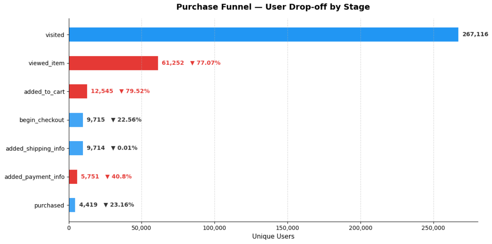
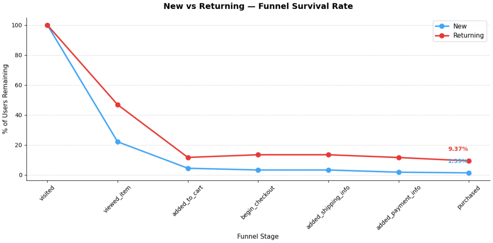
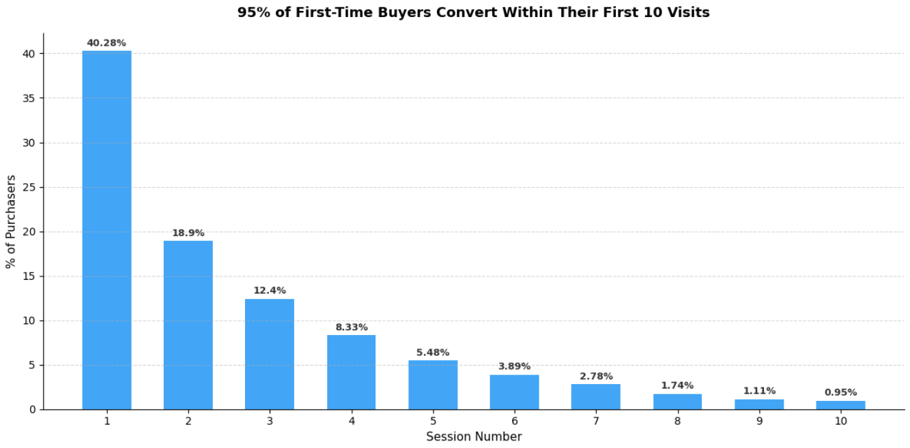
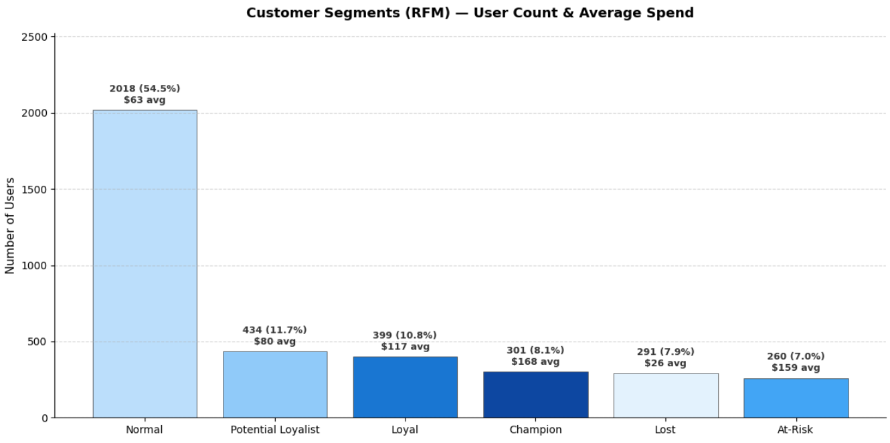

# Funnel Leaks: E-commerce Conversion Analysis (GA4)

## Overview

An exploratory product analytics project on Google's public GA4 obfuscated
sample e-commerce dataset (Google Merchandise Store), covering 92 days of
event data (Nov 2020 – Jan 2021).

The central questions are simple: how many visitors actually convert, and
where along the purchase journey does the rest of the traffic fall away?
It also asks whether that drop-off looks the same across all visitors or
differs depending on who they are — their device, traffic source, or
whether they've visited before. From there, the analysis extends into
session behavior, customer value segmentation, and intent signals like
search and promotion engagement.

## Dataset

- **Source:** `bigquery-public-data.ga4_obfuscated_sample_ecommerce`
- **Period:** Nov 1, 2020 – Jan 31, 2021 (92 days)
- **Scale:** ~4.3M events, 270K users, 4,452 clean transactions
- **Note:** This is Google's obfuscated public sample data. Some fields
  (`user_id`, `search_term`, deep campaign attribution) are obfuscated or
  null by design. See [Limitations](#limitations) for how this shaped the
  analysis.

## Tools

- SQL (BigQuery) handles all querying — CTEs and views — and aggregation
- Python (Pandas, Matplotlib) handles reshaping and visualization

## Key Findings at a Glance

- Overall conversion is **1.65%**, with the sharpest single drop-off
  (**41%**) happening at the payment step, not earlier in the funnel
- **Returning visitors convert at 6.7x the rate of new visitors**
  (9.37% vs 1.39%) — by far the strongest segmentation signal in the
  dataset; device and geography make almost no difference
- Sessions that end in a purchase are **7.7x longer and visit 9x more
  pages** than ones that don't — buyers behave like a different population,
  not lucky browsers
- Both **search use and promotion clicks correlate with ~4.4x higher
  conversion** — strong intent signals, though not proven to be causal
- **Apparel drives 47% of revenue**; a small group of At-Risk customers
  (~$159 avg spend, inactive 65+ days) are nearly as valuable as the top
  RFM segment but going quiet
- Cohort/retention and RFM frequency results were **inconclusive given
  the 92-day window** — reported with that caveat rather than overstated

---

## 1. Funnel Analysis

To find out where exactly users drop off between landing on the site and
completing a purchase — and whether that drop-off looks different for
different kinds of users — unique users were traced through the full
purchase funnel: visit → view item → add to cart → begin checkout → add
shipping → add payment → purchase.

**Findings**
- Overall conversion rate is **1.65%** — 98.35% of visitors never purchase
- **79% drop-off** between viewing an item and adding it to cart — high
  browse, low intent traffic
- **41% drop-off at the payment step**, despite near-zero drop-off at
  shipping — the sharpest single-step friction point in the funnel

**Segmented funnel**

| Segment | Finding |
|---|---|
| Device | Conversion and drop-off are nearly identical across desktop, mobile, and tablet — device is not a factor |
| Traffic medium | Referral converts best (1.89%), CPC worst (0.98%) despite being the only paid channel |
| New vs. Returning | Returning users convert at **9.37%** vs. **1.39%** for new users — a 6.7x difference, the strongest segmentation finding in the project |
| Geo (top 10 countries) | Conversion is consistent (1.49%–1.93%) across all top countries — drop-off is site-wide, not regional |

---

## 2. Session Analysis

To understand what separates a session that ends in purchase from one
that doesn't, and how many visits it typically takes before someone buys,
a session-level table (user + session ID, duration, pages visited,
engagement, purchase flag) was built from raw event data.

**Findings**
- Across 360K sessions: avg duration **3.38 min**, avg **3.75 pages**,
  **11%** of sessions never reach an engaged state, and only **1.35%**
  convert
- Purchasing sessions look fundamentally different from non-purchasing
  ones — **7.7x longer** (23.8 vs 3.1 min) and **9x more pages** (31 vs
  3.4), with **0% bounce rate** vs 11.3% for non-purchasers
- **40%** of buyers convert on their very first visit; the remaining 60%
  need multiple sessions before purchasing

---

## 3. Cohort & Retention Analysis

To check whether users come back after their first visit, and whether
buyers come back to buy again, weekly cohorts were built based on each
user's first activity, with return behavior tracked week-over-week — both
for all visitors and for the purchaser subset (repeat purchase).

**Findings**
- Week 1 retention varies by cohort but stays low across the board —
  roughly **1%-6.6%** of new visitors return the following week
  depending on the cohort
- Repeat purchase rate among buyers (return to purchase again) is
  roughly **0.8%-3.6%** in the week following their first purchase,
  also varying by cohort

**Limitation:** 92 days is insufficient for meaningful cohort/retention
analysis on a low-frequency merchandise store, where customers aren't
expected to buy weekly. A 12-month window would be needed to properly
evaluate retention, repeat purchase behavior, and acquisition trends. The
low numbers above reflect this constraint rather than a business problem.

---

## 4. Product & Revenue Analysis

To see what's actually driving revenue — which products and categories —
and identify the customers worth paying the most attention to, a
`clean_purchases` view was built to handle data quality issues found
during EDA (duplicate transaction IDs, null revenue/quantity on ~8% of
purchase rows).

**Overall metrics:** 4,452 clean transactions, 3,703 unique buyers, total
revenue **$307,707**, average order value **$69.12**

**Findings**
- The top 5 products by revenue are all apparel (hoodies, sweatshirts,
  joggers) — consistent with cold-weather demand given the Nov–Jan data
  window
- **Apparel drives 47% of total revenue** and dominates units sold and
  unique buyers — it is the core product line of this store

### RFM Segmentation

Segmented buyers using Recency, Frequency, and Monetary scores (quintile
based) into Champion, Loyal, Potential Loyalist, Normal, At-Risk, and Lost.

**Findings**
- **301 Champions (8.1%)** and **260 At-Risk customers (7%, ~$159 avg
  spend, 65+ days inactive)** are the highest-priority segments —
  At-Risk customers are nearly as valuable as Champions but have gone
  quiet
- **Limitation:** with only 92 days of data, these labels reflect a
  snapshot. Frequency scores especially would likely shift with a longer
  observation window, since most buyers (avg ~1 transaction) haven't had
  time to establish a repeat-purchase pattern

---

## 5. Search Behavior

To check whether using the site's search function signals that someone
is more likely to buy — `search_term` values are obfuscated
(`<obfuscated>`) so query content couldn't be analyzed, so instead
conversion rates were compared between users who did and didn't trigger
`view_search_results`.

**Findings**
- Users who searched convert at **6.1%** vs. **1.4%** for non-searchers —
  **4.4x higher**. Search activity is the strongest purchase-intent signal
  found in this dataset

---

## 6. Promotion Analysis

To check whether users who engage with on-site promotions convert at a
higher rate, conversion rates were compared between users who clicked a
promotion (`select_promotion`) and those who didn't.

**Findings**
- Users who clicked a promotion convert at **6.5%** vs. **1.5%** for
  non-clickers — **4.3x higher**, though this may reflect that high-intent
  users are simply more likely to interact with promotions, rather than
  promotions causing the conversion

---

## Limitations

- **92-day window:** too short for reliable cohort, retention, and
  repeat-purchase analysis, and for RFM frequency scoring to mature
- **Obfuscated fields:** `user_id` is null for nearly all rows (no
  logged-in/cross-device analysis), `search_term` is fully obfuscated,
  and some `traffic_source` attribution (especially paid search) is
  unreliable
- **Data quality:** raw purchase events contained duplicate
  `transaction_id`s and rows with null revenue/quantity — handled via a
  dedicated `clean_purchases` view (deduplicated, nulls filtered) used
  for all revenue and RFM analysis
- All findings are based on Google's obfuscated public sample data, which
  Google itself notes has "somewhat limited internal consistency" — numbers
  should be read as directional patterns, not exact business metrics

---

## Notebook

The full analysis, including all SQL queries, intermediate outputs, and
visualizations, is in
[`ga4-ecommerce-funnel-analysis.ipynb`](ga4-ecommerce-funnel-analysis.ipynb).
