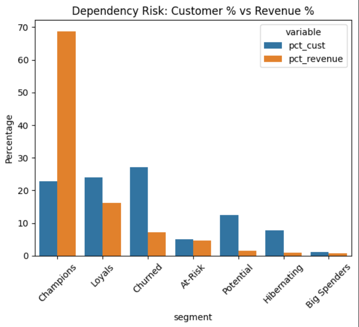
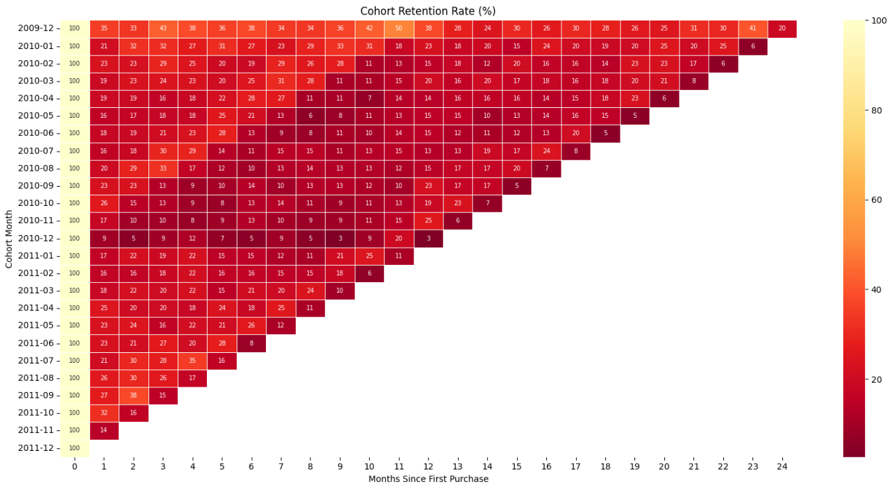

# Online Retail — Customer & Revenue Analysis

UCI Online Retail II dataset · UK gift retailer · Dec 2009 – Dec 2011  
**Stack:** Python (pandas) · DuckDB SQL · matplotlib / seaborn

---

## What this covers

Four linked analyses built on a single cleaned transaction table:

| Module | What it answers |
|---|---|
| **Revenue Trends** | Where did growth come from — volume, frequency, or basket size? |
| **RFM Segmentation** | Which customers are worth protecting vs. writing off? |
| **Cohort Retention** | Are newer customers sticking at the same rate as early ones? |
| **Simple CLV** | Which segments generate forward-looking value, not just historical spend? |

---

## Data decisions worth knowing

Started with 1,067,371 rows. Removed in order:

- **Duplicates** — exact row-level duplicates removed first
- **235,151 null Customer IDs (~23%)** — no ID means no behaviour tracking; dropped entirely
- **Null descriptions** — rows with no product description removed
- **Service/admin codes** — `POST`, `D`, `M`, `ADJUST`, `DOT`, `CRUK` are fees and internal codes, not sales
- **Cancellations (~2.2%)** — C-prefix invoices; invoice mismatch made matched-pair reconstruction unreliable, so dropped rather than guess
- **63 zero-price rows** — no transaction value, no useful signal
- **Dec 2011 excluded from MoM/YoY** — dataset ends Dec 9th; the partial month creates a -54% drop that isn't real
- **YoY comparisons exclude December both years** — ensures like-for-like months

---

## Key findings and where to act

### Revenue: volume is the lever, not price

Monthly Order Value (MOV) stays flat around £300 year-round while revenue swings significantly — peak months are explained entirely by more customers buying more often, not bigger baskets. Revenue grew year-over-year, driven by transaction count not price increases.

→ **Pricing changes alone won't move the needle.** Frequency and reactivation programs are the actual growth lever here.

### RFM: 46% of customers carry 85% of revenue

Champions and Loyals are holding up the entire revenue base. The bottom 30% of customers by value contribute 2.3% of revenue collectively.



→ **Size the risk before acting on growth.** Losing 10% of Champions represents a ~£1.17M revenue hit — larger than the entire Potential and Hibernating segment revenue combined. Retention investment for Champions and Loyals has a clear ceiling to work from.

→ **Upgrade Loyals before chasing new customers.** If 20% of Loyals reach Champion-level behavior, that's ~£1.91M in incremental revenue from the existing base with zero acquisition cost.

→ **Build a 55-account save list for At-Risk high-spenders.** These customers have a median value of £4,417 each and are already lapsing. At that individual account size, personal outreach is justified — this isn't a campaign, it's account management.

### Cohort: the retention floor is month 6

Customers who hit 3+ purchases within 90 days of acquisition convert to long-term at a meaningfully higher rate. Retention stabilizes around 15–21% after month 7 — whoever is still active at that point tends to stay.



→ **Month 6 is the intervention deadline.** Customers showing no repeat signal by then need active re-engagement or a clear decision to deprioritize. Waiting longer has diminishing returns.

→ **Holiday cohorts need their own acquisition ROI calc.** Dec 2010 had the worst 12-month retention of any cohort (2.63%) — if acquisition cost was elevated during peak season, that cohort likely destroyed value. Worth quantifying before repeating the same channel mix.

### Cohort quality over time: 2011 Potential pool is the priority

Conversion to Champions declined through 2010 peak months, recovered slightly, then 2011 cohorts show an unusually large "Potential" segment — customers who've bought but haven't established loyalty behavior yet.

→ **2011 Potential customers are the highest-leverage target right now.** They haven't churned; they just haven't committed. Early cohorts show this pool converts at reasonable rates with the right nudge.

### CLV: At-Risk customers are 23% more valuable than Loyals per head

The CLV estimate (Median Order Value × monthly purchase rate × 12) reveals that At-Risk customers have higher individual CLV than Loyals — meaning the business is losing its bigger spenders while retaining its smaller ones.

Two deliberate modelling choices keep the estimates grounded: purchase rate uses the full observation window (first purchase to dataset end) rather than each customer's own active span — this prevents single-purchase customers from inflating their rate to `1.0/month`. Order value uses the median per-invoice spend rather than the mean, so one large bulk order doesn't distort a customer's typical behaviour.

→ **Invert the attention model.** Standard practice over-invests in keeping average customers. The data says the highest-value recovery targets are in At-Risk, not in retention of the current loyal base.

> **CLV model scope:** this is a deterministic formula, not a probabilistic model (e.g. BG/NBD). It projects forward from observed behaviour and is best used for segment-level prioritisation, not individual-level forecasting.

---

## Structure

```
notebook/
└── Online_Retail_Customer___Revenue_Analysis.ipynb
    ├── 1. Data loading & cleaning
    ├── 2. Revenue analysis (monthly trends, MoM, YoY, geography)
    ├── 3. RFM segmentation + segment revenue concentration
    ├── 4. Cohort retention heatmap + cohort-to-segment mapping
    └── 5. Simple CLV by segment
```

---

## Data source

[UCI Online Retail II Dataset](https://archive.ics.uci.edu/dataset/502/online+retail+ii) — publicly available, no PII.
