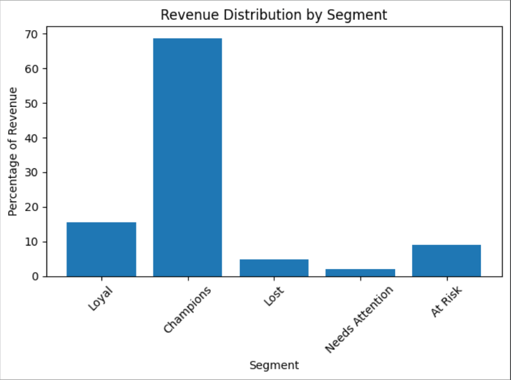
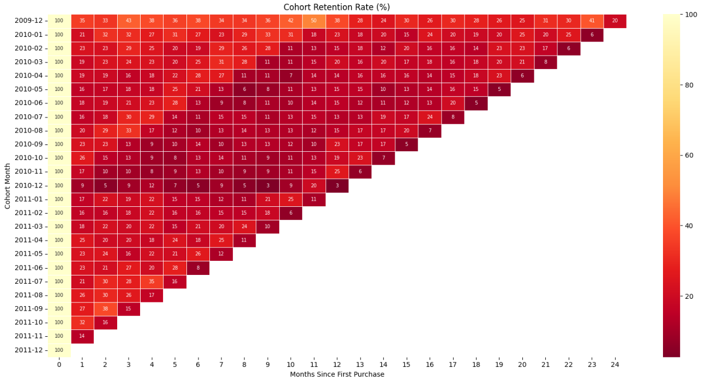

# Online Retail — Customer & Revenue Analysis

*UCI Online Retail II — UK gift retailer, Dec 2009 to Dec 2011. Cleaned in Python, analysed in DuckDB SQL.*

---

## Overview

Customer-focused analysis of a UK-based online gift retailer. Covers revenue trends, RFM segmentation, cohort retention, and simple CLV — with the goal of understanding who drives revenue, which customers are at risk, and where retention actually breaks down.

**5,853 customers · 1,067,371 raw rows · 2 years of transactions**

---

## Stack

Python (pandas) · DuckDB (in-process SQL) · Matplotlib · Seaborn

---

## Data Cleaning

Started with 1,067,371 rows. Removed duplicates, 235,151 null Customer IDs (~23% — no ID means no behaviour tracking), null descriptions, service/admin codes (`POST`, `D`, `M`, `ADJUST`, `DOT`, `CRUK`), cancellations (~2.2%, invoice mismatch made matched-pair reconstruction unreliable), and 63 zero-price rows.

---

## Revenue Analysis

Monthly revenue ranged from £443K (Feb 2011) to £1.13M (Nov 2011). Sep–Nov is consistently the heaviest period; Jan–Feb the softest. The seasonal pattern repeats clearly across both years.

**YoY the business was flat — but the reason matters.** Comparing Jan–Nov only (to exclude incomplete Dec 2011): 2010 revenue £7.66M, 2011 revenue £7.67M (+0.08%). Invoice count fell from 16,724 to 16,243 while customer count barely moved. Revenue held not through growth but through existing customers spending slightly more per transaction. Volume declined; spend per customer compensated.

AOV ranged £399–£554 with no directional trend. The Q4 revenue spike is volume-driven — November 2011 shows AOV dropping to £430 while customer count hit 1,661, the highest month in the dataset.

**UK contributes 83.67% of total revenue.** No other market crosses 4% — EIRE (3.49%), Netherlands (3.22%), Germany (2.24%), France (1.81%). Operationally this is a UK-only business.

---

## RFM Segmentation

Customers scored on Recency, Frequency, and Monetary using NTILE(5) bands and assigned to five segments.

| Segment | Customers | % Customers | Revenue | % Revenue |
|---|---|---|---|---|
| Champions | 1,330 | 22.72% | £11,725,399 | 68.64% |
| Loyal | 1,151 | 19.67% | £2,666,948 | 15.61% |
| At Risk | 712 | 12.16% | £1,533,096 | 8.97% |
| Lost | 1,948 | 33.28% | £814,168 | 4.77% |
| Needs Attention | 712 | 12.16% | £342,923 | 2.01% |

**Champions generate 68.64% of revenue from 22.72% of customers — and the gap is driven by frequency, not order size.** Champions average 0.96 orders/month versus Loyal at 0.63, while their AOVs are comparable (£449 vs £462). The revenue concentration is a frequency problem. Retaining Champions means keeping them buying regularly, not getting them to spend more per visit.

**Lost is the largest segment (33.28%) but generates 4.77% of revenue.** These customers had low frequency and low spend before going inactive — they were never high-value. Chasing this group is low-ROI.

**At Risk holds £1.53M in historical spend across 712 customers.** The top At Risk customers by monetary value had £77K, £65K, and £54K in prior spend, inactive 235–632 days. Unlike Lost, these customers earned their way into At Risk through real purchase history — they passed the early churn window and then went quiet. That makes them recoverable in a way Lost customers are not.

Recency distribution across all 5,853 customers:

| Recency | Customers | % |
|---|---|---|
| 0–30 days | 1,666 | 28.46% |
| 31–90 days | 1,220 | 20.84% |
| 91–180 days | 589 | 10.06% |
| 181–365 days | 796 | 13.60% |
| 365+ days | 1,582 | 27.03% |

28.46% bought within the last 30 days; 27.03% haven't bought in over a year. The distribution is polarised with a thin middle — customers are either active or gone, with very little gradual drift in between.

---

## Cohort Retention

Customers grouped by first purchase month and tracked monthly.

Retention drops sharply after month 1 (average 20.99% across all cohorts, range 9–35%), then stabilises at 15–21% from month 7 onward. Customers who survive past month 7 tend to stick — that is the loyalty threshold.

| Cohort | Acquired | Month 1 | Month 3 | Month 6 | Month 12 |
|---|---|---|---|---|---|
| 2009-12 | 952 | 35.08% | 42.54% | 37.82% | 37.71% |
| 2010-01 | 368 | 21.47% | 31.52% | 26.90% | 22.83% |
| All cohorts avg | — | 20.99% | 21.71% | 17.94% | ~15–17% |

**The Dec 2009 cohort retained 37.71% at month 12 — roughly double the average.** Of 952 customers acquired that month, ~359 were still active a year later. This shows the 15–21% average retention is not a ceiling. The Dec 2010 cohort is the weakest — likely one-time seasonal buyers with low re-purchase intent from the start.

---

## Simple CLV

12-month CLV per customer estimated as `avg_order_value × monthly_purchase_rate × 12`, segmented by RFM.

| Segment | Customers | Avg CLV (12m) | Total CLV (12m) |
|---|---|---|---|
| Champions | 1,330 | £5,943 | £7,904,483 |
| At Risk | 712 | £4,401 | £3,133,670 |
| Needs Attention | 712 | £3,967 | £2,824,737 |
| Loyal | 1,151 | £3,560 | £4,097,429 |
| Lost | 1,948 | £3,424 | £6,670,228 |

Champions average £5,943 projected CLV. The Lost segment figure (£3,424) is overstated — the formula uses historical purchase rate and doesn't account for churn. The At Risk figure (£4,401) is meaningful: these customers have the history and the formula reflects real past behaviour, not a ghost of it.

---

## Files

| File | Description |
|---|---|
| `online_retail_II.xlsx` | Raw data — UCI dataset, two sheets |
| `online_retail.ipynb` | Full analysis — cleaning, SQL queries, and visualisations |
