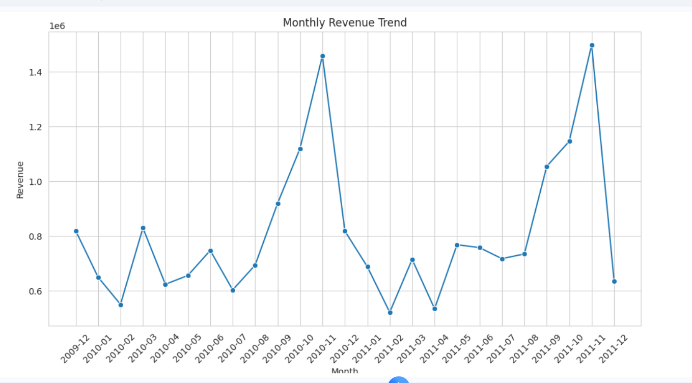
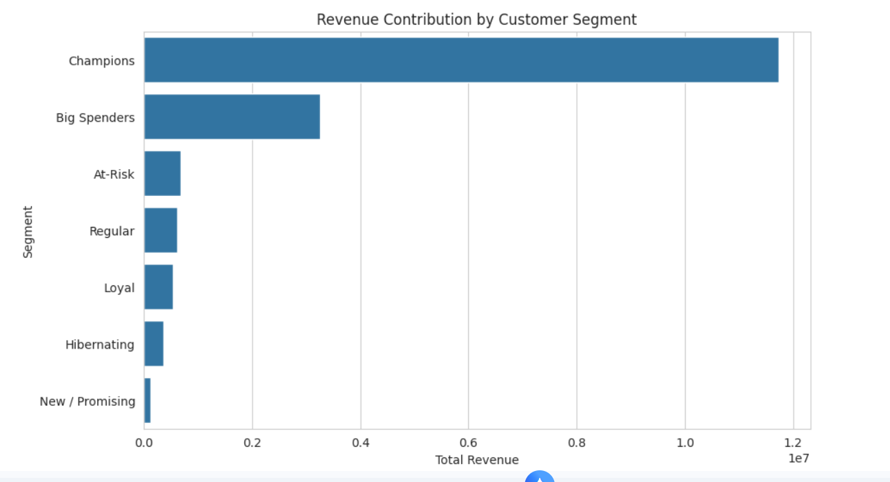
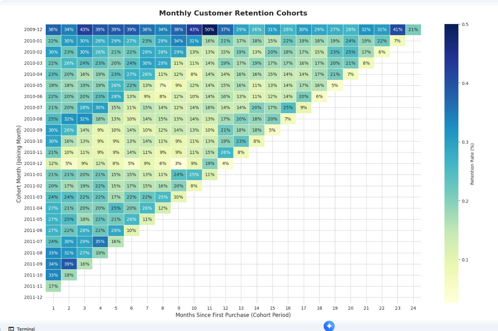
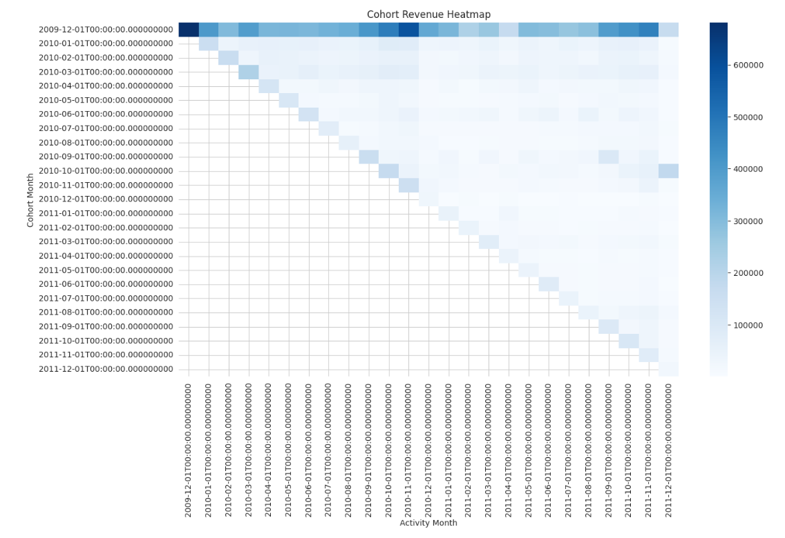
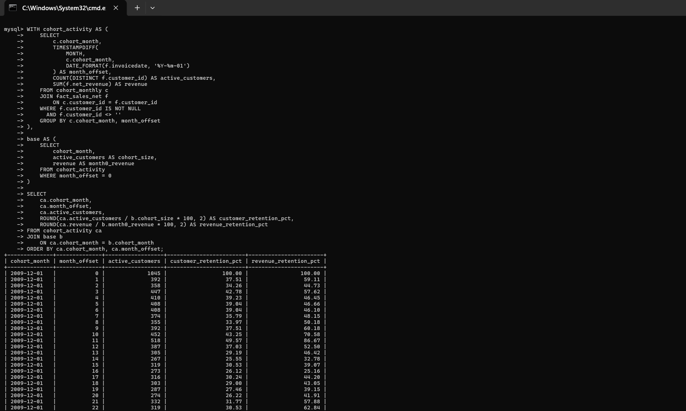
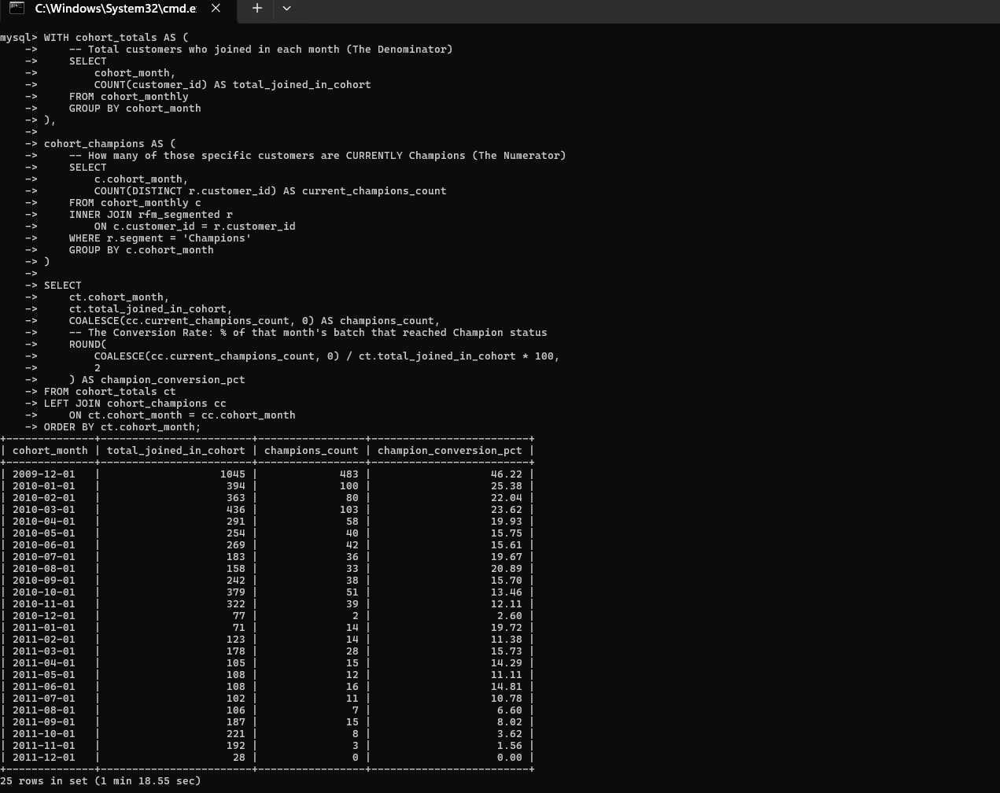

# Online Retail Customer & Revenue Analysis

## Project Overview

This project analyzes transactional data from an online retail business to uncover revenue patterns, customer behavior, and long-term retention dynamics. The goal goes beyond surface-level reporting — it connects data findings to real business risk and opportunity.

- **Dataset:** `online_retail.csv`
- **Time Period:** 2009–2011
- **Total Revenue:** ~$22.5M
- **Scope:** Revenue trends, RFM customer segmentation, cohort retention and Champion conversion analysis

---

## Key Questions This Project Answers

- Who actually drives revenue — and what happens if we lose them?
- Which customers are at risk, and how much revenue is on the line?
- Do newer customers behave differently from early ones — and why?
- Where does retention break down, and when does it stabilize?

---

## Key Findings

### 1. Revenue Analysis

**Trend:** The dataset begins in December 2009 (one month only), so 2009-to-2010 comparisons are skewed. Meaningful year-over-year comparison starts from 2010. Revenue levels remain relatively stable between 2010 and 2011 — indicating consistent performance rather than rapid growth or decline.

**Geographic Concentration:** The United Kingdom dominates, contributing ~90% of total revenue. Secondary markets (EIRE, Netherlands, Germany, France) exist but contribute marginally. The business is geographically concentrated — a strength in its core market, but a structural risk if that market softens.

> *Note: Data cleaning revealed that filtering null/empty `CustomerID` records resolved anomalies in the country-level revenue distribution. Analysis is based on verified, complete records only.*

---

### 2. RFM Segmentation

RFM (Recency, Frequency, Monetary) scoring was used to segment customers into value tiers. The results reveal extreme revenue concentration.

| Segment | Revenue Share |
|---|---|
| Champions | ~67.7% |
| Big Spenders | ~18.8% |
| At-Risk | ~3.9% |
| Regular | ~3.5% |
| Loyal | ~3.1% |
| Hibernating | ~2.1% |
| New / Promising | ~0.7% |

**What this means:**

- Champions and Big Spenders together generate **~86% of total revenue**. The business is not just top-heavy — it is almost entirely dependent on a small customer group.
- Only **2.07% of customers** (~123 people) generate **40% of revenue**. About **22.7%** generate **80%** — a stronger-than-typical Pareto pattern.
- Several At-Risk customers (high monetary score, recency score of 1) have not purchased in **430–630 days** despite historically very high spend. These individuals represent concentrated, recoverable revenue loss.
- New / Promising customers contribute less than 1% of revenue today but are the pipeline for future Champions — if nurtured early.

**Business implication:** Losing even a small number of Champions or Big Spenders creates outsized revenue impact. Retention of this group is not a nice-to-have — it is the core revenue protection strategy.

---

### 3. Cohort & Retention Analysis

Cohort analysis tracked customers by their first purchase month to understand how retention and revenue evolve over time.

**Customer Retention:**
- Retention drops sharply after the first month across nearly all cohorts — typically from 100% to 20–35% by Month 1–2.
- After this initial drop, a stable repeat-customer base forms, with 15–30% of customers continuing to purchase over time.
- This pattern is consistent with typical e-commerce behavior: most customers churn early, but those who stay become the long-term revenue base.

**Revenue Retention — a critical distinction:**
- Revenue retention is consistently *higher* than customer retention across cohorts.
- This means: even as fewer customers remain active, the ones who do spend *more* over time.
- This directly validates the RFM findings — the high-value customer group self-selects through continued engagement. Retaining fewer, higher-value customers is more impactful than broad retention.

**Cohort longevity:**
- Early cohorts (December 2009) show sustained engagement across 20+ months — evidence that long-term loyalty is achievable.
- Revenue heatmaps show the earliest cohorts generating darker revenue concentrations, reflecting disproportionate long-term value from early acquisitions.

---

### 4. Champion Conversion Analysis

Champion conversion tracks how many customers from each cohort eventually reach Champion status (top RFM tier).

- The **December 2009 cohort** achieved the highest conversion rate (~46%).
- Most cohorts convert between **10–25%** of customers to Champion status.
- Newer cohorts show lower conversion rates (<10%) — but this is expected: they simply haven't had enough time to accumulate the purchase history required to qualify. This is a maturity effect, not a quality difference.

**Why this matters:** Monitoring Champion conversion over time — and accounting for cohort age — is a more honest measure of loyalty program effectiveness than raw conversion rates alone.

---

## Combined Business Takeaways

| Theme | Finding | Implication |
|---|---|---|
| Revenue concentration | Top ~2% of customers = 40% of revenue | High sensitivity to churn in this group |
| Segment dependency | Champions + Big Spenders = ~86% of revenue | Retention is a revenue protection strategy |
| At-Risk exposure | High-value At-Risk customers inactive 430–630 days | Targeted re-engagement = recoverable revenue |
| Retention dynamics | Revenue retention > customer retention | Remaining customers increase spend over time |
| Cohort value | Early cohorts show strongest long-term revenue | Onboarding quality has compounding impact |
| Champion conversion | Newer cohorts appear lower due to maturity, not quality | Evaluate conversion on cohort-adjusted timelines |
| Geography | ~90% of revenue from UK | Geographic diversification = risk reduction opportunity |

---

## Methodology

### Python
- Loaded and explored raw dataset; examined missing values, refunds, and cancellations
- Filtered incomplete records (null `CustomerID`) to ensure data integrity
- Split raw data into relational tables: `customers`, `products`, `orders`, `order_items`
- Exported CSVs for SQL processing
- Built visualizations: revenue trends, country breakdown, cohort heatmaps

### SQL
- Calculated RFM scores and assigned customer segments
- Identified At-Risk high-value customers by recency and monetary score
- Computed cohort retention, revenue retention, and Champion conversion rates
- Aggregated revenue by year, country, and segment

### Visualization (Python / Seaborn / Matplotlib)
- Revenue trend over time
- Revenue by country (post data cleaning)
- Cohort revenue heatmap (monthly)
- Customer retention heatmap (monthly cohorts)

---

## Files Included

| File | Description |
|---|---|
| `online_retail.csv` | Raw transactional data |
| `customers.csv` | Customer table |
| `products.csv` | Product reference table |
| `orders.csv` | Order-level data |
| `order_items.csv` | Line-item level data |
| Python notebooks | Data cleaning, EDA, and visualizations |
| SQL scripts | RFM segmentation, cohort metrics, retention and Champion conversion queries |

---

## Screenshots

### Visualizations

**Revenue Trends**

**RFM Revenue Contribution**

**Customer Retention Heatmap**

**Revenue Retention Heatmap**

### SQL Queries

**Retention Logic**

**Champion Conversion**

